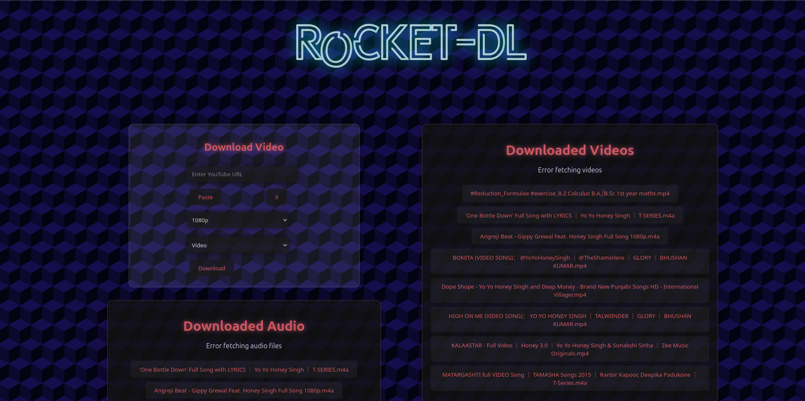

# YT-DLP App

A simple web application for downloading videos and audio using **yt-dlp**. This guide includes instructions for setting up, running the project, and creating a Linux application for easy startup.

---



## Features
- **Backend**: Node.js server using `yt-dlp` to process video downloads.
- **Frontend**: React-based user interface.
- **Linux Application**: Easy-to-launch Linux app with a `.desktop` entry.

---

## Prerequisites
Make sure you have the following installed:
1. **Node.js** (v14 or later)
2. **npm** (Node Package Manager)
3. **Linux** environment (tested on Ubuntu)

---

## Installation

### 1. Clone the Repository
```bash
git clone https://github.com/RoyRoki/YT-DLP-App.git
cd YT-DLP-App
```

### 2. Install Dependencies
#### Backend:
```bash
cd backend
npm install
```

#### Frontend:
```bash
cd ../
npm install
```

---

## Running the Application

### Start the Backend
Run the backend server:
```bash
cd backend
node server.js
```

### Start the Frontend
Run the React app:
```bash
cd ../
npm start
```

---

## Creating a Linux Application

### Step 1: Create a Shell Script
Create a script to start the backend and frontend together:
1. Create the script:
   ```bash
   nano ~/start-yt-dlp-app.sh
   ```

2. Add the following code:
   ```bash
   #!/bin/bash
   cd /home/roki/React/yt-dlp-app/backend
   nohup node server.js > /dev/null 2>&1 &
   
   cd /home/roki/React/yt-dlp-app
   nohup npm start > /dev/null 2>&1 &
   ```

3. Save and exit the file.

4. Make it executable:
   ```bash
   chmod +x ~/start-yt-dlp-app.sh
   ```

### Step 2: Create a Desktop Entry
Add a shortcut for easy access:
1. Create a `.desktop` file:
   ```bash
   nano ~/.local/share/applications/yt-dlp-app.desktop
   ```

2. Add the following content:
   ```plaintext
   [Desktop Entry]
   Type=Application
   Name=YT-DLP App
   Exec=/bin/bash -c "/home/roki/start-yt-dlp-app.sh"
   Icon=/home/roki/React/yt-dlp-app/public/slylogox.png
   Terminal=false
   Categories=Utility;
   ```

3. Save and exit the file.

4. Reload the application menu:
   ```bash
   update-desktop-database ~/.local/share/applications
   ```

You can now search for "YT-DLP App" in your application menu.

### Step 3: (Optional) Set Up Autostart
To make the app start automatically at boot:
```bash
cp ~/.local/share/applications/yt-dlp-app.desktop ~/.config/autostart/
```

---

## Stopping the Application
To stop the backend and frontend, find the process IDs and kill them:
1. List running processes:
   ```bash
   ps aux | grep server.js
   ps aux | grep npm
   ```

2. Kill the processes:
   ```bash
   kill <PID>
   ```

---

## Contributing
Feel free to submit issues or pull requests to improve this project.

---

This `README.md` provides clear instructions for setup, usage, and creating a Linux application for your **yt-dlp-app**.